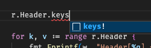
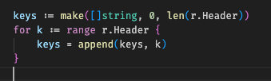
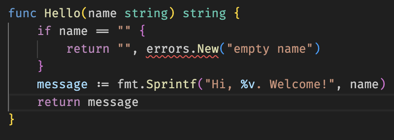
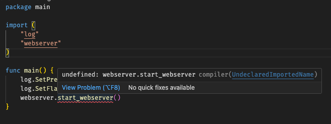
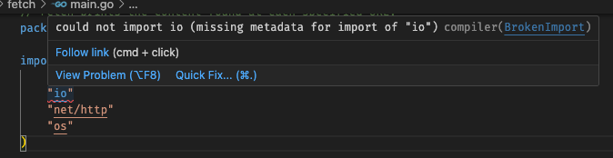

# Learning Go.

I decided to learn Go because... well, why not? I have my reasons. Here are some of my notes. 

## The really important points
* Get used to typing ```go mod tidy``` alot. It's there to make sure the nice packages listed in go.mod match the ones in your source code.

## Various points
* **case sensitivity** - Go is case sensitive
* **main** - The application must start from a function called main. In this way, it's like C# (used to be before they added scripting).
* **go run tidy** - When a new package is added, you must run ```go run tidy``` to download the package locally.
* **workspaces (since 1.16)** - If you have subfolders within the workspace, you'll need to create a go.work file that identifies and uses all the sub-modules. To do this, run ```go work init ./mainfolder```
* **go.mod** - The go.mod file keeps track of the necessary modules to include in the particular directory where your go files are located.
* **undeployed modules** - If a go folder isn't deployed yet, then you need it to be local. From the directory where the module is located, you'd redirect the go tools from the module path to the local directory. This is done by typing, ```go mod edit -replace example.com/greetings=../greetings```. 
    * When you do this, it's going to add a replace line into the go.mod file. 
    * After that, run the go mod tidy again, this synchronizes things, and adds another line into the go.mod that properly references the new directory. 
* **unused variables without warning** - An underscore can be used to set a variable that you don't want to use. 
* **foreach note** - To do a foreach, try the following pattern:
   ```
   for x, y := range some_map {
      fmt.Println(x)
      fmt.Println(y)
   }
   ```
* **exporting** - Functions are private or exported based on capitalization rules. This makes Go strongly linked to the language conventions.
* **make()** - Default values for variables must be initialized using the make() function. If you don't call make(), many values are unassigned. So declaring a map would be ```var m = make(map[string]int)``` for example.
* **vscode helpers** - There are some spectacular helpers in go. The following intellisense, when selected...

   

   will produce the following block of code

   
* **range on an array** - calling ```range``` on a map *or* array is always going to yield two values. In the case of the map, the key is the first return and the value is the second return. In the case of an array, the key is going to be the index in the array, and the value is the value. This is different than other languages, where a foreach will yield only the single value contained within the array. 
* **default in switch** - While it seems that, technically, the default case can be put anywhere in a switch statement, the static check will warn you, and suggest you put in as the first or last case in the switch.
   
## File setups
* **package vs module declarations** - Generally speaking, ```go mod init``` should be followed by the full path to the module. You want to see, for example,  ```module webserver/drawing``` in go.mod, but only ```package drawing``` within the actual go file that runs the module. This will allow modules to be moved around with relative ease. 

## Notes on data types
* **type conventions** Unlike most languages, the type of arrays are preceded by brackets instead of being succeeded by brackets. eg, ```[]string``` instead of ```string[]```
* **map is like dict** - The ```map``` type is what would be considered a ```dict``` in python. You define both the key type and the value type. So a map of ints, keyed by string, would be map[string]int

## Solutions to common issues

### Parameter count mismatch

Consider the following situation:



The root of the problem here is the mismatch with the error value return with the return value of the function itself. Go is a typed language, and the return values must be declared in the declaration of the function. This is different than, say, Python or JavaScript, which infers the type.

To fix this, change the return type on the first line, and then change the last line of the function, because that would be out of alignment once you change the return type.

### Not Exported



This issue is rather simple to fix. Put simply, you can't use an unexported function in go. What is the solution? 

Go exports by code convention.

**Capitalized functions are exported, non-capitalized functions are not**

That's pretty much it. Change the function from start_webserver to Start_webserver, and bingo. It's working.

### Broken Import 

What to do when a package import is missing.



This has to do with the change to Go from 1.16+, which is to use workspaces intsead of GOROOT. Chances are you have modules in subdirectories below the root directory. What you need is a go.work file. Go to the root directory and type

```go work init```

and that will get things going. 